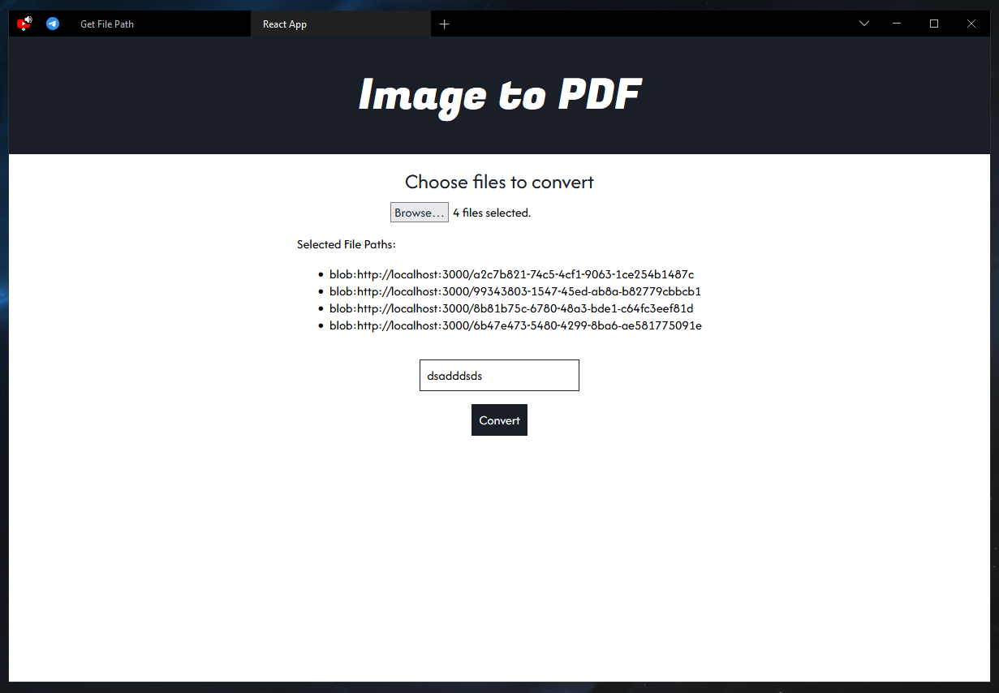

# File Selector and PDF Converter

This project is a simple file selector and PDF converter built with React and jsPDF.

## Getting Started

1. Clone the repository:

   ```bash
   git clone https://github.com/your-username/file-selector-pdf-converter.git
   ```

2. cd file-selector-pdf-converter

## Install dependencies:

    npm install

## Start the development server:

    npm start

The application will be accessible at http://localhost:3000 by default.

## Usage

Choose files to convert by clicking on the "Choose files to convert" button.
Enter a filename for the PDF in the input field.
Click the "Convert" button to generate the PDF.

## Features

1. Supports multiple file selection.
2.  Converts selected images into a single PDF.
3.  Maintains the original size of images in the PDF.

## Dependencies

1. React
2. jsPDF

## License

>This project is licensed under the MIT License - see the LICENSE file for details.
